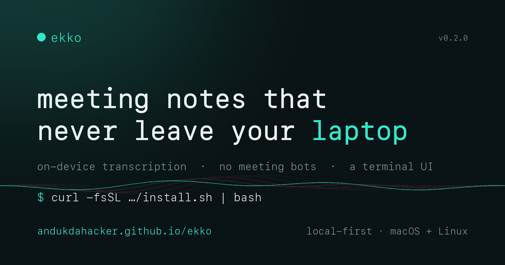

# ekko

<a href="https://andukdahacker.github.io/ekko/"></a>

**ekko** — a local-first, privacy-preserving meeting notetaker. Audio and transcription
stay **on your device**; only the derived summary text is sent to a cloud model
(Gemini Flash) for summarization — and only if you choose a cloud summarizer.

No meeting bots: it captures audio locally, so it works for Google Meet,
Microsoft Teams, and in-person meetings alike.

🌐 **[ekko website](https://andukdahacker.github.io/ekko/)** · [Install](#install-one-command) · [Docs](docs/)

## Architecture (every stage is a swappable interface)

```
audio source ─▶ whisper ─▶ diarize ─▶ identify ─▶ summarize ─▶ store ─▶ integrations
  (laptop)     (local)   (optional)  (names)     (Gemini)    (sqlite)   (markdown)
```

- **source** — `LaptopSource` today; a phone-upload source drops in later (same interface).
- **transcribe** — `faster-whisper`, fully on-device.
- **diarize** — optional pyannote overlay (Speaker A/B/C). Off by default.
- **identify** — names speakers. v1: manual map (in-person). Online screen-watching
  (`ScreenIdentifier`) is stubbed and plugs in without pipeline changes.
- **summarize** — provider-agnostic. Gemini Flash default; Claude or a local 8B are drop-ins.
- **integrations** — Markdown/Obsidian today; Notion/Slack/Asana implement the same adapter.

📖 **Full documentation** — architecture, current implementation, and roadmap live in
[`docs/`](docs/) (start at [`docs/README.md`](docs/README.md)).

## Install (one command)

macOS or Linux, Python 3.10+. This installs ekko into an isolated venv, puts an
`ekko` command on your PATH, and scaffolds `~/.ekko/config.toml`:

```bash
curl -fsSL https://raw.githubusercontent.com/andukdahacker/ekko/main/install.sh | bash
```

Then finish setup:

```bash
$EDITOR ~/.ekko/config.toml               # paste your Gemini key (summarize.api_key)

# fully offline instead? set summarize.provider = "local" (Ollama):
#   install Ollama (https://ollama.com), then: ollama pull qwen2.5:7b
#   nothing leaves the device — audio, transcript, AND summary all stay local

# online meetings:
#   macOS 14.4+:  nothing to set up — ekko taps system audio in place
#   macOS <14.4:  brew install blackhole-2ch && ekko audio setup
#   Linux:        sudo apt install pulseaudio-utils  (or pipewire-pulse) — no setup

ekko                                      # opens the TUI
```

> Linux online capture uses PulseAudio/PipeWire monitor sources. It's implemented
> but not yet verified on a live Linux box — see [`docs/linux.md`](docs/linux.md).

### Updating

```bash
ekko update      # upgrades in place, from wherever it was installed
```

`ekko update` reinstalls from the source pip recorded at install time (git URL or
PyPI). If you installed from a **source checkout** (`pip install -e .`), it tells
you to `git pull` instead. Re-running `install.sh` also upgrades; `pipx`/`uv`
users can `pipx upgrade ekko` / `uv tool upgrade ekko`.

ekko also **nudges you when a newer release exists** (checked against GitHub
releases at most once a day, in the background — never blocks a command). Disable
with `EKKO_NO_UPDATE_CHECK=1`. The nudge is off until you replace the `andukdahacker/ekko`
placeholder in `ekko/__init__.py` (`REPO_URL`) with your real repo.

> Publishing your own fork? Replace `OWNER` in the URL above (and in
> `install.sh` / `pyproject.toml`) with your GitHub user/repo.

Prefer a Python packaging tool? `ekko` is a standard console script, so this also
works: `pipx install git+https://github.com/andukdahacker/ekko` or
`uv tool install git+https://github.com/andukdahacker/ekko`.

## Development setup (from source)

```bash
git clone https://github.com/andukdahacker/ekko && cd ekko
python3 -m venv .venv && source .venv/bin/activate
pip install -e .            # editable: installs deps + the `ekko` command

mkdir -p ~/.ekko && cp config.example.toml ~/.ekko/config.toml
$EDITOR ~/.ekko/config.toml               # set summarize.api_key (or export GEMINI_API_KEY)
```

To run `ekko` from anywhere without activating the venv, symlink its launcher
onto your PATH (this is what `install.sh` does):

```bash
mkdir -p ~/.local/bin
ln -sf "$(pwd)/.venv/bin/ekko" ~/.local/bin/ekko    # ~/.local/bin must be on $PATH
```

Now **`ekko`** (opens the TUI), `ekko record`, `ekko list`, etc. work from any
directory — the launcher's shebang points at the venv's Python, so dependencies
resolve without activation.

### Online meetings (system audio)

**macOS 14.4+ — nothing to set up.** ekko captures the system audio mix in place
using a Core Audio process tap: no BlackHole, no virtual devices, no output
rerouting. Your speakers and volume keys are untouched.

```bash
ekko record --kind online      # captures system audio + your mic, out of the box
```

**macOS <14.4 (fallback)** routes audio through a BlackHole loopback + your mic.
`ekko audio setup` builds the devices for you:

```bash
brew install blackhole-2ch     # one-time loopback driver (needs admin)
ekko audio setup               # creates "ekko capture" + "ekko output", writes config
ekko record --kind online      # auto-routes output to "ekko output" during capture
```

Note: on the fallback path, "ekko output" is a Multi-Output Device, and macOS
can't adjust volume for those — but ekko only routes to it *during* a recording
and restores your normal output afterward. The tap path (14.4+) avoids this
entirely.

**Linux** uses PulseAudio/PipeWire monitor sources — see
[`docs/linux.md`](docs/linux.md).

## Usage

```bash
ekko                                   # open the TUI (default, like lazygit)
ekko tui                               # ...or explicitly

ekko record --kind in_person --title "1:1 with Priya"
# ● Recording… press Enter to stop → transcribe → summarize → writes a Markdown note

ekko audio setup                       # one-time: create online-capture devices
ekko record --kind online              # online meeting (auto-routes output)
ekko process meeting.wav --kind online # process an existing file
ekko devices                           # list input devices (+ --test)
ekko list                              # past meetings
ekko update                            # upgrade in place
ekko uninstall                         # remove ekko (--purge also removes data)
```

In the TUI: **r/o** record · **s** stop · **p** play · **v** reveal · **R**
re-process · **/** search · **y** copy note · **x** delete · **?** help · **q**
quit. A live transcript preview shows while you record.

> Not installed as a command yet? Any `ekko …` also works as
> `python -m ekko.cli …` from the repo with the venv active.

## Roadmap (deferred by design)

A **terminal UI** (start/stop recording, browse meetings, read notes, play audio
— all from the terminal), plus phone-as-source, online speaker naming, voiceprint
enrollment, a local offline summarizer, a self-hosted notes backend, and more
integrations. Each plugs into a frontend or interface seam that already exists.
See [`docs/roadmap.md`](docs/roadmap.md) for the full list and which seam each
one uses.
